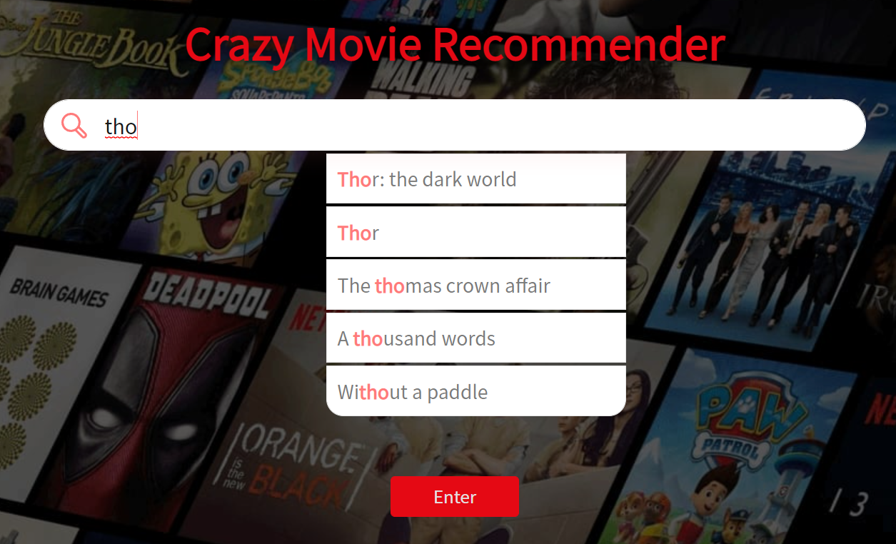
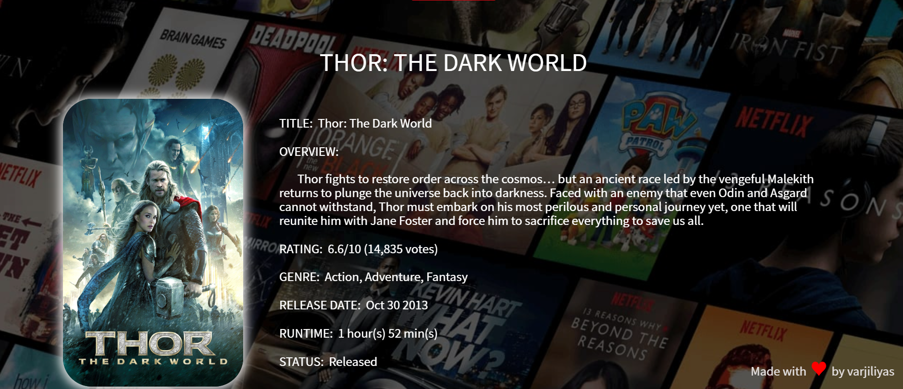
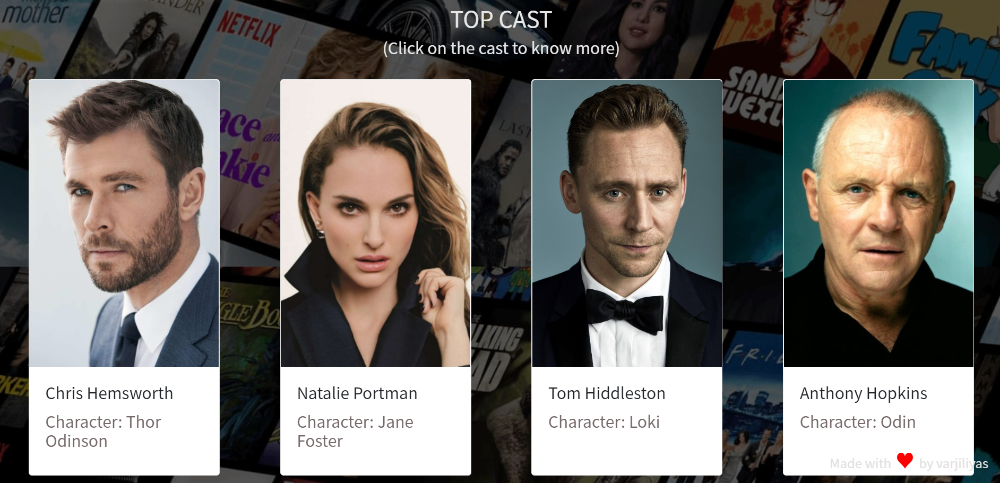
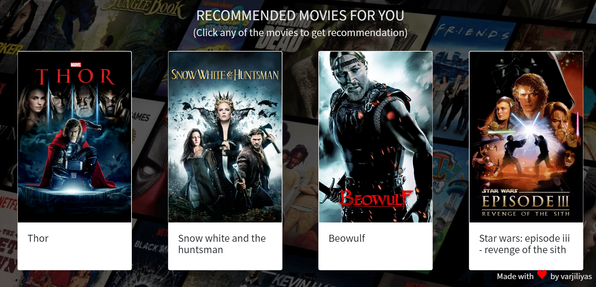

## 👥 Crazy-Movie-Recommender

Creazy-Movie-Recommender is a "Movie Recommendation" Web Application built under Microsoft Engage Mentorship Program 2022.

## Features of "Creazy-Movie-Recommender"
1. **A search box where we can enter the name of movie.**
2. **Autocomplete text suggestion.**
3. **Name of the movie.**
4. **short overview about movie**
5. **rating of movie (-/10) and voting also.**
6. **Genre of movie.**
7. **Release date.**
8. **Runtime of the movie.**
9. **status (movie released or not).**
10. **About the top cast of the movie.**
11. **Name of the cast and character name.**
12. **After hovering on cast know more option.**
13. **In know more photo of cast birth date, birth place and Biography.**
14. **User Reviews comments and sentiments.**
15. **10 Recommended movie for you similar as we searched.**
16. **Get more recommendation after clicking recommended movie.**

 
## Deployment

#####🚀 Here's the link of the web application ( deployed on heroku ) 🚀

 https://crazy-movie-recommender.herokuapp.com/

## Video Demonstration
#####🚀 Here's the link to the video demonstration of Creazy-Movie-Recommender 🚀

https://youtu.be/R2x2HyuvgOI

## The real Algorithm working behind the recommondation system

I am taking the example of netfix web-streaming app, how does Netflix rank titles?
It is quite clear that Netflix utilises a two-tiered row-based ranking system, where ranking happens:

**Within each row (strongest recommendations on the left)**
**Across rows (strongest recommendations on top)**

Each row highlights a particular theme (e.g. Top 10, Trending, Horror, etc), and is typically generated using one algorithm. Each member’s homepage consists of approximately 40 rows of up to 75 items, depending on the device the member is using.

**What algorithms are used?**
Netflix uses a variety of rankers mentioned in its paper, though specifics of each model’s architecture is not specified. Here is a summary of what they are:

##### Personalised Video Ranking (PVR) -

##### Top-N Video Ranker —

##### Trending Now Ranker — 

 ##### Video-Video Similarity Ranker —a.k.a. Because you watched (BYW)

In my project i am work for Video-Video Similarity algorithm This algorithm basically resembles that of a content-based filtering algorithm. Based on an item consumed by the member, the algorithm computes other similar items (using an item-item similarity matrix) and returns the most similar items. Amongst the other algorithms, this one is unpersonalised as no other side features are utilised. However, it is personalised in the sense that it is a conscious choice to display a particular item’s similar items a member’s homepage (more details in Page Generation below).

## Architecture

## Similarity Score : 

   How does it decide which item is most similar to the item user likes? Here come the similarity scores.
   
   It is a numerical value ranges between zero to one which helps to determine how much two items are similar to each other on a scale of zero to one. This similarity score is obtained measuring the similarity between the text details of both of the items. So, similarity score is the measure of similarity between given text details of two items. This can be done by cosine-similarity.
   
## How Cosine Similarity works?
  Cosine similarity is a metric used to measure how similar the documents are irrespective of their size. Mathematically, it measures the cosine of the angle between two vectors projected in a multi-dimensional space. The cosine similarity is advantageous because even if the two similar documents are far apart by the Euclidean distance (due to the size of the document), chances are they may still be oriented closer together. The smaller the angle, higher the cosine similarity.
  
  

  
More about Cosine Similarity : [Understanding the Math behind Cosine Similarity](https://www.machinelearningplus.com/nlp/cosine-similarity/)

## Approach Towards Building the Project
#### Development Methodology - Scrum Methodology
Agile Scrum Methodology is basically incremental development i.e. we build the product in iterations, step by step.

We work in “Sprints” where each sprint lasts for a week or two, and focus on building the important features first and then improve the product to make it more potential.

Here are the sprints I had set for myself for the 4 week journey 😄
##### WEEK 1 ( INITIAL DAYS )
1. deciding the project which are the more interesting.
2. Read the documentation about how Netflix or spotify algotithm.
3. Learning more about jupyter Notebook.
4. Deciding the Tech Stack and finding suitable resources.

##### WEEK 2 ( BUILD PHASE )
1. download the movie datasets from https://www.kaggle.com and wikipedia.
2. Recommendation is based on only the name of actor genre and title so we need to extract data from datasets.
3. collecting more movie's data releasing in 2018, 2019.
4. Merging all data and making final datasets.

##### WEEK 3 ( BUILD PHASE )
1. working for front-end using **HTML CSS** and **JAVASCRIPT**
2. getting data from **Ajax request**
3. Adding more feature like reviews and comments into a dictionary

##### WEEK 4 ( ADAPT PHASE )
1. Making GitHub repository and Uploading code on GitHub.
2. Deploying the application on Heroku – Main motive being, taking inputs from friends and mentors - What improvements can be made.
3. Working on making Video Demo & updating README.md

### SNAPSHOTS

### Libraries and Dependencies

The project “Creazy-Movie-Recommender” is built using Jupyter Notebook, Python, Flask, HTML, CSS, Javascript & AJAX

### Sources of the datasets 

1. [IMDB 5000 Movie Dataset](https://www.kaggle.com/carolzhangdc/imdb-5000-movie-dataset)
2. [The Movies Dataset](https://www.kaggle.com/rounakbanik/the-movies-dataset)
3. [List of movies in 2018](https://en.wikipedia.org/wiki/List_of_American_films_of_2018)
4. [List of movies in 2019](https://en.wikipedia.org/wiki/List_of_American_films_of_2019)
5. [List of movies in 2020](https://en.wikipedia.org/wiki/List_of_American_films_of_2020)
